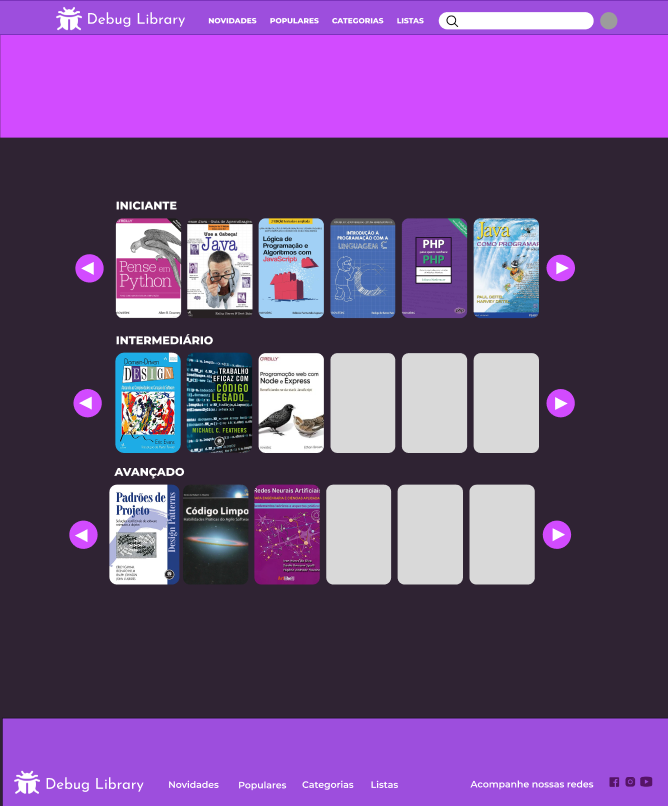
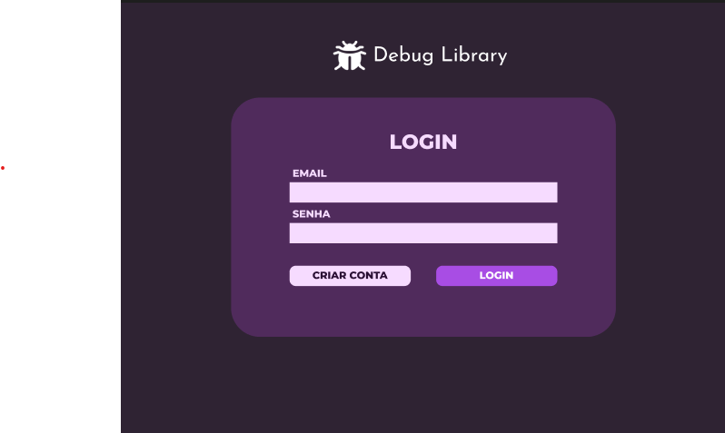
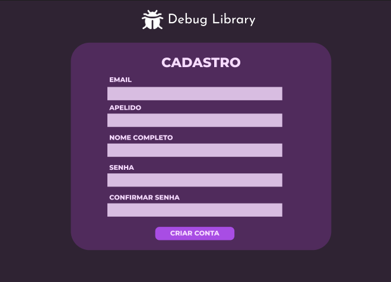
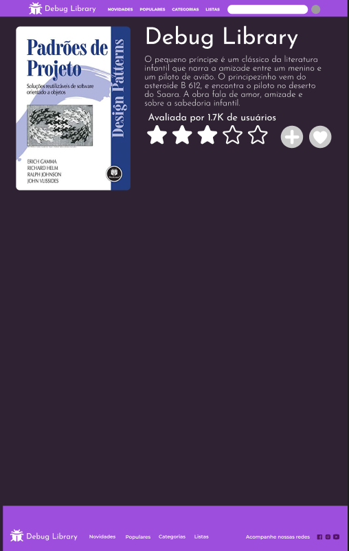

# 📚 Debug Library

**Debug Library** é uma plataforma de avaliação e recomendação de livros de computação, abrangendo desde o nível iniciante até o avançado. O objetivo é oferecer aos usuários uma curadoria colaborativa de livros técnicos, com avaliações detalhadas, resenhas e categorização por nível de conhecimento.

## 🚀 Funcionalidades

- 📖 Catálogo de livros de computação categorizados por nível (iniciante, intermediário, avançado)
- ⭐ Sistema de avaliações e resenhas feito pelos usuários

## 🛠️ Tecnologias Utilizadas

O projeto foi desenvolvido com as seguintes tecnologias modernas:

### Frontend

- **React** – Biblioteca para construção de interfaces modernas e reativas  
- **TypeScript** – Tipagem estática para JavaScript, trazendo mais segurança ao código  
- **Tailwind CSS** – Framework utilitário para estilização rápida e responsiva    

### Protótipo do Projeto no Figma

### Tela Inicial



### Tela de Login

<p align="center">
  
</p>

### Tela de Cadastro



### Tela de Informações do Perfil


### Tela de Informações do Livro (v1)



### Modal Informações do Livro (v2)


## 👥 Integrantes

| Nome                   | Função              |
|------------------------|---------------------|
| Alice Lavínia Honorato de Cerqueira Vasconcelos | Frontend Developer 👩‍💻  |
| Gabriel Clementino Clementino Ávila | Frontend Developer 👨‍💻   |
| Guilherme Gonzaga | Backend Developer 👨‍💻        |
| Ivanildo Marques de Souza Filho | UI/UX Designer 🎨      |
| Maria de Fátima Nunes Alves | Frontend Developer & Tech Lead 👩‍💻  |

## 📌 Como Executar o Projeto

### Pré-requisitos

- Node.js (v18+)
- Yarn ou npm

### Instalação

```bash
# Clone o repositório
git clone https://github.com/seu-usuario/debug-library.git
cd debug-library
